# Pay402 Architecture & Flow Diagram

**Purpose:** Visual overview of Pay402's payment flow and architecture for hackathon judges.

---

## System Architecture

```mermaid
graph TB
    subgraph "Buyer Experience"
        B[👤 Buyer Browser]
        W[🎨 Payment Widget<br/>React + Enoki]
    end
    
    subgraph "Facilitator Service<br/>(Railway Deployment)"
        F[⚡ Facilitator API<br/>Express + TypeScript]
        FS[🔐 Facilitator Signer<br/>Ed25519 Keypair]
    end
    
    subgraph "SUI Blockchain<br/>(Testnet)"
        ZK[🔑 zkLogin Service<br/>Google OAuth → SUI Address]
        PTB[📦 Programmable Transaction Block<br/>USDC Split + Payment + Receipt]
        SC[📜 Smart Contract<br/>settle_payment()]
        USDC[💵 USDC Coins<br/>Circle Native on SUI]
    end
    
    subgraph "Merchant"
        M[🏪 Merchant Server<br/>Demo API]
        MC[💰 Merchant Address<br/>SUI Wallet]
    end

    %% Flow connections
    B -->|1. Click Pay| W
    W -->|2. OAuth Login| ZK
    ZK -->|3. Derive Address| W
    W -->|4. Request PTB| F
    F -->|5. Build PTB| PTB
    PTB -->|6. Return PTB bytes| W
    W -->|7. Verify PTB| W
    W -->|8. Sign PTB| W
    W -->|9. Submit Signed PTB| F
    F -->|10. Sponsor Gas + Execute| PTB
    PTB -->|11. Split USDC| USDC
    PTB -->|12. Call settle_payment| SC
    SC -->|13. Transfer to Merchant| MC
    SC -->|14. Emit Receipt Event| PTB
    PTB -->|15. Confirm| F
    F -->|16. Return Digest| W
    W -->|17. Redirect + Payment Proof| M
    M -->|18. Deliver Content| B

    style W fill:#9333ea,color:#fff
    style F fill:#2563eb,color:#fff
    style ZK fill:#10b981,color:#fff
    style PTB fill:#f59e0b,color:#000
    style SC fill:#ef4444,color:#fff
    style USDC fill:#06b6d4,color:#fff
```

---

## Payment Flow Sequence (Optimistic Mode)

```mermaid
sequenceDiagram
    participant B as 👤 Buyer
    participant W as 🎨 Widget
    participant Z as 🔑 zkLogin/Enoki
    participant F as ⚡ Facilitator
    participant S as 🔗 SUI Blockchain
    participant M as 🏪 Merchant

    Note over B,M: User arrives at merchant's premium content

    B->>M: Request premium content
    M->>B: Return 402 Payment Required + Invoice JWT
    
    B->>W: Open payment widget with invoice
    W->>Z: Authenticate with Google OAuth
    Z->>W: Return zkLogin credentials + SUI address
    
    W->>F: POST /build-ptb (invoice JWT)
    F->>F: Validate invoice signature
    F->>F: Build PTB: split USDC + settle_payment()
    F->>W: Return PTB bytes
    
    W->>W: Client-side PTB verification<br/>(parse bytes, check merchant/amount)
    W->>W: Display payment details to user
    B->>W: Confirm payment
    
    W->>W: Sign PTB with zkLogin
    W->>F: POST /submit-payment (signed PTB, optimistic mode)
    
    F->>F: Validate signature + USDC balance
    F->>F: Validate PTB structure
    F->>W: ✅ 200 OK "Safe to deliver"
    
    Note over F,S: Facilitator submits in background (non-blocking)
    F->>S: Execute transaction (gas sponsored)
    S->>S: Process PTB: Split → Transfer → Receipt
    
    W->>M: Redirect with payment digest
    M->>M: Verify payment (optional on-chain check)
    M->>B: ✅ Deliver premium content
    
    Note over B: User receives content in ~2 seconds
    Note over S: Transaction finalizes on-chain (~400ms)
```



---

## Component Breakdown

### 1. Payment Widget (Frontend)
**Tech Stack:** React, TypeScript, Vite, Enoki SDK  
**Deployed:** https://widget-production-8b65.up.railway.app  
**Role:**
- User authentication via Google OAuth (zkLogin)
- PTB verification before signing
- Transaction signing with zkLogin keypair
- Payment UX (confirmations, receipts)

**SUI-Specific Features:**
- ✅ zkLogin integration (no wallet needed)
- ✅ PTB parsing and verification
- ✅ Session management via Enoki

---

### 2. Facilitator (Backend)
**Tech Stack:** Node.js, Express, TypeScript, SUI SDK  
**Deployed:** https://pay402-production.up.railway.app  
**Role:**
- Build PTBs for payments
- Sponsor gas fees (buyer needs no SUI)
- Submit transactions to blockchain
- Validate invoices and signatures

**SUI-Specific Features:**
- ✅ Programmable Transaction Block construction
- ✅ Gas sponsorship (facilitator pays)
- ✅ Optimistic settlement (0ms blockchain wait)
- ✅ Pessimistic settlement (~400ms finality)

---

### 3. Smart Contract (Move)
**Package ID:** `0x5f32be9e6eee3aab5c64c2f2df6c7e5e83f0e683fd83fda9bb66aa05b063f1ca`  
**Module:** `x402_payment`  
**Function:** `settle_payment<T>()`  

**Role:**
- Accept PTB with USDC split
- Transfer merchant amount to merchant
- Transfer facilitator fee to facilitator
- Emit receipt event with invoice hash

**SUI-Specific Features:**
- ✅ Generic coin type support (`Coin<T>`)
- ✅ On-chain event emission (cheap audit trail)
- ✅ Atomic PTB execution (no shared state)

---

### 4. Merchant (Demo Server)
**Tech Stack:** Node.js, Express  
**Deployed:** https://merchant-production-0255.up.railway.app  
**Role:**
- Serve premium content behind 402 paywall
- Generate invoice JWTs
- Verify payment completion
- Display payment receipts

**x402 Protocol:**
- ✅ HTTP 402 "Payment Required" responses
- ✅ Invoice JWT with merchant signature
- ✅ Payment verification via transaction digest

---

## Key SUI Advantages Highlighted

### 1. zkLogin (Web2 → Web3 Bridge)
- **Problem:** Traditional wallets are friction for new users
- **SUI Solution:** OAuth-based authentication, deterministic address derivation
- **Pay402 Benefit:** No wallet install, familiar Google login

### 2. Programmable Transaction Blocks (PTBs)
- **Problem:** Complex multi-step transactions require multiple signatures
- **SUI Solution:** Atomic transaction composition with single signature
- **Pay402 Benefit:** Split coin + payment + receipt in one transaction

### 3. Gas Sponsorship
- **Problem:** Users need native tokens for gas (chicken-egg problem)
- **SUI Solution:** Third party can sponsor gas for transactions
- **Pay402 Benefit:** Buyer needs only USDC, facilitator pays gas

### 4. Object Model (Owned Objects)
- **Problem:** EVM global state creates coordination overhead, Solana account conflicts
- **SUI Solution:** Object ownership prevents conflicts, enables parallelism
- **Pay402 Benefit:** Massive scalability, thousands of concurrent payments

### 5. On-Chain Events
- **Problem:** EVM event storage is expensive, indexing is complex
- **SUI Solution:** Events are cheap, efficient, and permanent
- **Pay402 Benefit:** Every payment emits receipt event for merchant audit trail

---

## Settlement Modes Comparison

| Feature | Optimistic | Pessimistic |
|---------|-----------|-------------|
| **Content Delivery** | Immediate (after validate + submit) | After on-chain finality |
| **Blockchain Latency** | 0ms (background) | ~400ms (testnet) |
| **Risk** | Facilitator guarantees (very low risk) | Zero risk (on-chain confirmed) |
| **Use Case** | Low-value content, fast UX | High-value, trustless |
| **Buyer Experience** | Content in ~2 seconds | Content in ~2.5 seconds |

**Optimistic Mode Flow:**
1. Facilitator validates signature, balance, PTB structure
2. Returns "Safe to deliver" (HTTP 200)
3. Buyer receives content immediately
4. Facilitator submits transaction in background
5. Transaction finalizes on-chain (~400ms later)

**Key Insight:** Facilitator acts as guarantor. Comprehensive validation before submit eliminates most risk. Only remaining risk: buyer spends USDC elsewhere between submit and finality - mitigated by fast SUI finality (~400ms) and immediate validation.

---

## Live Testnet Deployment

**Demo URL:** https://merchant-production-0255.up.railway.app  
**Network:** SUI Testnet  
**Proof Transaction:** https://suiscan.xyz/testnet/tx/EV7D7z9gjzjrAQSKWSW8S1iLGdk8aEVPjn3zLA1aUSLE

**Services:**
- Facilitator: https://pay402-production.up.railway.app
- Widget: https://widget-production-8b65.up.railway.app
- Merchant: https://merchant-production-0255.up.railway.app

**Status:** ✅ Full end-to-end flow working on testnet (as of Feb 5, 2026)

---

## Next Steps & Roadmap

**Post-Hackathon:**
1. **Browser Extension** (Tier 2 PTB Verification)
   - Lightweight extension (no wallet complexity)
   - Client-side PTB verification without facilitator trust
   - User only needs OAuth + one-time USDC funding

2. **Merchant Widget** (Embeddable)
   - JavaScript snippet (Stripe model)
   - Drop into any website
   - Customizable UI themes

3. **Multi-Chain Support** (CCTP)
   - Accept USDC from any chain
   - Circle CCTP for bridging
   - Single merchant, multi-chain buyers

4. **Advanced Features**
   - Recurring payments (subscriptions)
   - Escrow for refundable purchases
   - Privacy enhancements (coin mixing)

---

**Document Version:** 1.0  
**Last Updated:** February 8, 2026  
**Status:** Ready for Hackathon Submission
